# AWS Architecture Documentation

## System Architecture Diagram

```mermaid
flowchart TB
    subgraph Internet["🌐 Internet"]
        Users["👥 Users"]
    end

    subgraph AWS["☁️ AWS Cloud"]
        IGW["🚪 Internet Gateway"]
        
        subgraph VPC["🔒 VPC (10.0.0.0/16)"]
            subgraph PublicSubnets["📤 Public Subnets"]
                subgraph PubA["Public Subnet A<br/>10.0.1.0/24 | AZ-1"]
                    EC2_A["🖥️ EC2 Instance<br/>Flask App"]
                end
                subgraph PubB["Public Subnet B<br/>10.0.2.0/24 | AZ-2"]
                    EC2_B["🖥️ EC2 Instance<br/>Flask App"]
                end
            end
            
            ALB["⚖️ Application Load Balancer"]
            
            subgraph PrivateSubnets["🔐 Private Subnets"]
                subgraph PriA["Private Subnet A<br/>10.0.3.0/24 | AZ-1"]
                    RDS_Primary["🗄️ RDS MySQL<br/>Primary"]
                end
                subgraph PriB["Private Subnet B<br/>10.0.4.0/24 | AZ-2"]
                    RDS_Standby["🗄️ RDS MySQL<br/>Standby (Multi-AZ)"]
                end
            end
            
            subgraph SecurityGroups["🛡️ Security Groups"]
                SG_ALB["SG-ALB<br/>Port 80, 443"]
                SG_EC2["SG-EC2<br/>Port 80 from ALB"]
                SG_RDS["SG-RDS<br/>Port 3306 from EC2"]
            end
        end
        
        subgraph EB["🚀 Elastic Beanstalk"]
            AutoScaling["📈 Auto Scaling Group"]
            HealthCheck["❤️ Health Monitoring"]
        end
    end

    Users -->|HTTPS| IGW
    IGW --> ALB
    ALB --> EC2_A
    ALB --> EC2_B
    EC2_A -->|Port 3306| RDS_Primary
    EC2_B -->|Port 3306| RDS_Primary
    RDS_Primary -.->|Sync| RDS_Standby
    
    EB -.-> EC2_A
    EB -.-> EC2_B
    
    SG_ALB -.-> ALB
    SG_EC2 -.-> EC2_A
    SG_EC2 -.-> EC2_B
    SG_RDS -.-> RDS_Primary
    SG_RDS -.-> RDS_Standby
```

---

## Data Flow Diagram

---

## Network Architecture

---

## Component Details

### 1. VPC (Virtual Private Cloud)

| Property | Value |
|----------|-------|
| CIDR Block | `10.0.0.0/16` |
| DNS Hostnames | Enabled |
| DNS Resolution | Enabled |

### 2. Subnets

| Subnet | CIDR | Type | AZ | Purpose |
|--------|------|------|-----|---------|
| Public-A | `10.0.1.0/24` | Public | AZ-1 | EC2 instances, ALB |
| Public-B | `10.0.2.0/24` | Public | AZ-2 | EC2 instances, ALB |
| Private-A | `10.0.3.0/24` | Private | AZ-1 | RDS Primary |
| Private-B | `10.0.4.0/24` | Private | AZ-2 | RDS Standby |

### 3. Security Groups

### 4. Route Tables

#### Public Route Table
| Destination | Target |
|-------------|--------|
| `10.0.0.0/16` | local |
| `0.0.0.0/0` | Internet Gateway |

#### Private Route Table
| Destination | Target |
|-------------|--------|
| `10.0.0.0/16` | local |

---

## Application Architecture

---

## Deployment Pipeline

```mermaid
flowchart LR
    Code["📝 Code<br/>application.py"] --> Zip["📦 ZIP Bundle<br/>+ requirements.txt"]
    Zip --> EB["🚀 Elastic Beanstalk<br/>Upload & Deploy"]
    EB --> EC2["🖥️ EC2 Instances<br/>Auto-provisioned"]
    EC2 --> Live["✅ Live Application"]
```

---

## High Availability Design

---

## Security Architecture

### Security Controls

| Layer | Control | Implementation |
|-------|---------|----------------|
| **Network** | VPC Isolation | Custom VPC with no default rules |
| **Subnet** | Public/Private | RDS in private subnets (no internet access) |
| **Firewall** | Security Groups | Least privilege access between tiers |
| **Transport** | HTTPS | SSL/TLS termination at ALB |
| **Database** | Encryption | RDS encryption at rest |
| **Access** | IAM | Role-based access control |

---

## Cost Optimization

| Component | Cost Factor | Optimization Strategy |
|-----------|-------------|----------------------|
| EC2 | Compute hours | Use t3.micro (free tier) or right-size |
| RDS | Instance + storage | db.t3.micro, single-AZ for dev |
| ALB | LCU hours | Included with Elastic Beanstalk |
| Data Transfer | Outbound data | Use CloudFront for static assets |

---

## Scaling Strategy

---

## Environment Variables

| Variable | Description | Source |
|----------|-------------|--------|
| `DB_HOST` | RDS endpoint | AWS RDS console |
| `DB_USER` | Database username | RDS configuration |
| `DB_PASSWORD` | Database password | Secrets/secure config |
| `DB_NAME` | Database name | RDS configuration |

---

## Monitoring & Logging

### Key Metrics to Monitor

| Metric | Threshold | Action |
|--------|-----------|--------|
| CPU Utilization | > 70% | Scale out |
| Database Connections | > 80% of max | Investigate |
| Request Latency | > 2s | Investigate |
| Error Rate | > 5% | Alert |
| RDS Storage | > 80% | Increase storage |
