# Flask Deployment on AWS with RDS

A production-ready **Flask web application** deployed on **AWS Elastic Beanstalk** with **MySQL RDS** in a secure VPC architecture.


## Overview

This project demonstrates a secure, scalable insurance claims management system with:

- **Flask application** in public subnets (accessible via Application Load Balancer)
- **MySQL RDS** in private subnets (isolated from the internet)
- **Security groups** controlling traffic between components
- **Cost-optimized** architecture without NAT Gateway

## Architecture

> 📄 **[View Complete Architecture Documentation](Docs/Architecture.md)** - Includes detailed diagrams for data flow, security layers, scaling strategy, and more.

```mermaid
flowchart TB
    subgraph Internet["🌐 Internet"]
        Users["👥 Users"]
    end

    subgraph AWS["☁️ AWS Cloud"]
        IGW["🚪 Internet Gateway"]
        
        subgraph VPC["🔒 VPC (10.0.0.0/16)"]
            subgraph PublicSubnets["📤 Public Subnets"]
                subgraph PubA["Public Subnet A<br/>10.0.1.0/24 | AZ-1"]
                    EC2_A["🖥️ EC2 Instance<br/>Flask App"]
                end
                subgraph PubB["Public Subnet B<br/>10.0.2.0/24 | AZ-2"]
                    EC2_B["🖥️ EC2 Instance<br/>Flask App"]
                end
            end
            
            ALB["⚖️ Application Load Balancer"]
            
            subgraph PrivateSubnets["🔐 Private Subnets"]
                subgraph PriA["Private Subnet A<br/>10.0.3.0/24 | AZ-1"]
                    RDS_Primary["🗄️ RDS MySQL<br/>Primary"]
                end
                subgraph PriB["Private Subnet B<br/>10.0.4.0/24 | AZ-2"]
                    RDS_Standby["🗄️ RDS MySQL<br/>Standby"]
                end
            end
        end
        
        subgraph EB["🚀 Elastic Beanstalk"]
            ASG["📈 Auto Scaling"]
        end
    end

    Users -->|HTTPS| IGW
    IGW --> ALB
    ALB --> EC2_A
    ALB --> EC2_B
    EC2_A -->|Port 3306| RDS_Primary
    EC2_B -->|Port 3306| RDS_Primary
    RDS_Primary -.->|Sync| RDS_Standby
    EB -.-> EC2_A
    EB -.-> EC2_B
```



<details>
<summary>📋 View ASCII Diagram (for terminals without Mermaid support)</summary>

```
┌─────────────────────────────────────────────────────────────────────────┐
│                              AWS VPC (10.0.0.0/16)                      │
│                                                                         │
│  ┌────────────────────────────┐    ┌────────────────────────────┐      │
│  │     Public Subnet A        │    │     Public Subnet B        │      │
│  │      (10.0.1.0/24)         │    │      (10.0.2.0/24)         │      │
│  │  ┌──────────────────────┐  │    │  ┌──────────────────────┐  │      │
│  │  │   EB EC2 Instance    │  │    │  │   EB EC2 Instance    │  │      │
│  │  │   (Flask App)        │  │    │  │   (Flask App)        │  │      │
│  │  └──────────────────────┘  │    │  └──────────────────────┘  │      │
│  └────────────────────────────┘    └────────────────────────────┘      │
│                    │                            │                       │
│                    └──────────┬─────────────────┘                       │
│                               ▼                                         │
│                 ┌──────────────────────────┐                            │
│                 │  Application Load Balancer│                           │
│                 └──────────────────────────┘                            │
│                               │                                         │
│  ┌────────────────────────────┼────────────────────────────┐           │
│  │     Private Subnet A       │     Private Subnet B       │           │
│  │      (10.0.3.0/24)         │      (10.0.4.0/24)         │           │
│  │         ┌──────────────────┴───────────────────┐        │           │
│  │         │         RDS MySQL (Primary)          │        │           │
│  │         │         (Multi-AZ Optional)          │        │           │
│  │         └──────────────────────────────────────┘        │           │
│  └─────────────────────────────────────────────────────────┘           │
└─────────────────────────────────────────────────────────────────────────┘
                               │
                               ▼
                    ┌─────────────────┐
                    │ Internet Gateway │
                    └─────────────────┘
                               │
                               ▼
                         [ Internet ]
```
</details>

## Tech Stack

| Category | Technology | Purpose |
|----------|------------|---------|
| **Backend** | Flask (Python) | Web framework for API & app logic |
| **Database** | Amazon RDS (MySQL) | Managed relational database |
| **Connector** | PyMySQL | Python MySQL client library |
| **Compute** | Elastic Beanstalk | Application deployment & auto-scaling |
| **Load Balancer** | Application Load Balancer | Traffic distribution |
| **Networking** | VPC, Subnets, IGW | Custom network isolation |
| **Security** | Security Groups | Firewall rules |

## Project Structure

```
├── application.py          # Main Flask application
├── requirements.txt        # Python dependencies
├── insured.sql             # Database schema
├── nginx.conf              # Nginx configuration (optional)
├── Docs/
│   ├── Architecture.md     # Detailed architecture diagrams
│   └── Notes.md            # Step-by-step deployment guide
├── static/
│   ├── style.css           # Application styles
│   └── images/             # Static images
└── templates/
    ├── index.html          # Home page template
    └── claim.html          # Claim submission form
```

## Prerequisites

- AWS Account with appropriate permissions
- Python 3.x installed locally
- AWS CLI configured (optional)
- MySQL client for database setup

## Environment Variables

The application requires the following environment variables:

| Variable | Description | Example |
|----------|-------------|---------|
| `DB_HOST` | RDS endpoint | `prodb.xxxxx.rds.amazonaws.com` |
| `DB_USER` | Database username | `admin` |
| `DB_PASSWORD` | Database password | `your-secure-password` |
| `DB_NAME` | Database name | `insured` |

## Quick Start

### 1. Clone the Repository

```bash
git clone https://github.com/Khushal41/AWS-Flask---RDS-Deployment-on-AWS-Elastic-Beanstalk.git
cd AWS-Flask---RDS-Deployment-on-AWS-Elastic-Beanstalk
```

### 2. Local Development

```bash
# Create virtual environment
python -m venv venv
source venv/bin/activate  # Linux/Mac
venv\Scripts\activate     # Windows

# Install dependencies
pip install -r requirements.txt

# Set environment variables
export DB_HOST=localhost
export DB_USER=root
export DB_PASSWORD=yourpassword
export DB_NAME=insured

# Run the application
python application.py
```

### 3. Deploy to AWS

See the detailed deployment guide in [Docs/Notes.md](Docs/Notes.md).

**Quick deployment steps:**

1. Create VPC with public/private subnets
2. Configure security groups
3. Launch RDS MySQL in private subnets
4. Create database schema using `insured.sql`
5. Zip application files and deploy to Elastic Beanstalk
6. Configure environment variables in EB console

## API Endpoints

| Method | Endpoint | Description |
|--------|----------|-------------|
| `GET` | `/` | Home page with insurance products |
| `GET` | `/claim` | Claim submission form |
| `POST` | `/claim` | Submit a new claim |

## Database Schema

```sql
CREATE TABLE claims (
    id INT AUTO_INCREMENT PRIMARY KEY,
    policy_id VARCHAR(255) NOT NULL,
    name VARCHAR(255) NOT NULL,
    dob DATE NOT NULL,
    mobile VARCHAR(20) NOT NULL,
    created_at TIMESTAMP DEFAULT CURRENT_TIMESTAMP
);
```

## Security Best Practices

- **RDS in Private Subnets**: Database is not accessible from the internet
- **Security Groups**: Restrict traffic to only necessary ports and sources
- **Environment Variables**: Sensitive data stored as environment variables, not in code
- **Use AWS Secrets Manager** (recommended): Store database credentials securely
- **Enable HTTPS**: Configure SSL certificate on the load balancer

## Troubleshooting

| Issue | Solution |
|-------|----------|
| Database connection failed | Verify security group allows EB instances to connect to RDS on port 3306 |
| Application not starting | Check EB logs: `eb logs` or AWS Console |
| 502 Bad Gateway | Ensure `application.py` uses correct WSGI entry point |
| Environment variables not set | Verify in EB Console → Configuration → Software |

## Cost Optimization

This architecture is optimized for cost:

- **No NAT Gateway**: EB instances in public subnets with public IPs
- **db.t3.micro**: Suitable for development/small workloads
- **Single-AZ RDS**: Use Multi-AZ for production if needed
- **Load-balanced environment**: Auto-scales based on demand

## Contributing

1. Fork the repository
2. Create a feature branch (`git checkout -b feature/amazing-feature`)
3. Commit your changes (`git commit -m 'Add amazing feature'`)
4. Push to the branch (`git push origin feature/amazing-feature`)
5. Open a Pull Request

## License

This project is open source and available under the [MIT License](LICENSE).

## Author

**Khushal Ravindra Bhavsar**

[](https://www.linkedin.com/in/khushal-bhavsar-/)
[](https://github.com/Khushal41)

Full Stack MERN Developer | Python & Cloud Enthusiast
